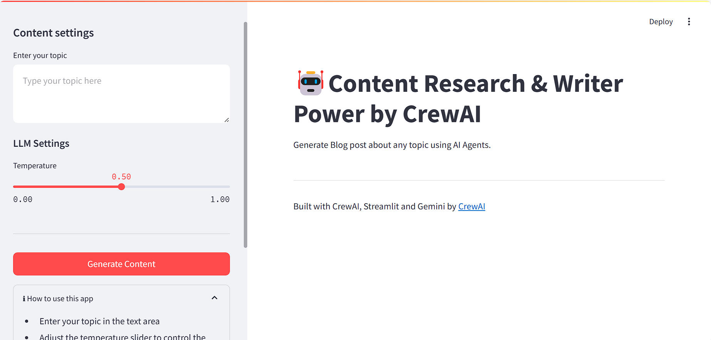

# Content Research & Writer Powered by CrewAI

This project is a Streamlit application that generates blog posts about any topic using AI Agents. It leverages the CrewAI framework, Gemini LLM, and SerperDevTool for comprehensive research and content creation.


## Features

- Generate blog posts on any topic
- Adjust the creativity of the generated content using a temperature slider
- Download the generated content as a markdown file

## Setup

1. Clone the repository:
    ```sh
    git clone https://github.com/rrpatil-1/crewai_agentic_blog_generator
    cd Crew_ai_agent
    ```

2. Create a virtual environment and activate it:
    ```sh
    python -m venv venv
    source venv/bin/activate  # On Windows use `venv\Scripts\activate`
    ```

3. Install the required dependencies:
    ```sh
    pip install -r requirements.txt
    ```

4. Create a `.env` file in the project root and add your API keys:
    ```env
    GEMINI_API_KEY=<your_gemini_api_key>
    SERP_API_KEY=<your_serper_api_key>
    LLM_MODEL=<your_llm_model>
    ```

## Usage

1. Run the Streamlit application:
    ```sh
    streamlit run streamlit_app.py
    ```

2. Open your web browser and navigate to `http://localhost:8501`.

3. Enter your topic in the text area, adjust the temperature slider, and click the "Generate Content" button.

4. Wait for the AI to generate the content and download the results as a markdown file.

## Contributing

Contributions are welcome! Please open an issue or submit a pull request for any improvements or bug fixes.

## License

This project is licensed under the MIT License. See the [LICENSE](LICENSE) file for details.

## Acknowledgements

- [CrewAI](https://crewai.com)
- [Streamlit](https://streamlit.io)
- [Gemini](https://gemini.com)
- [SerperDevTool](https://serper.dev)
